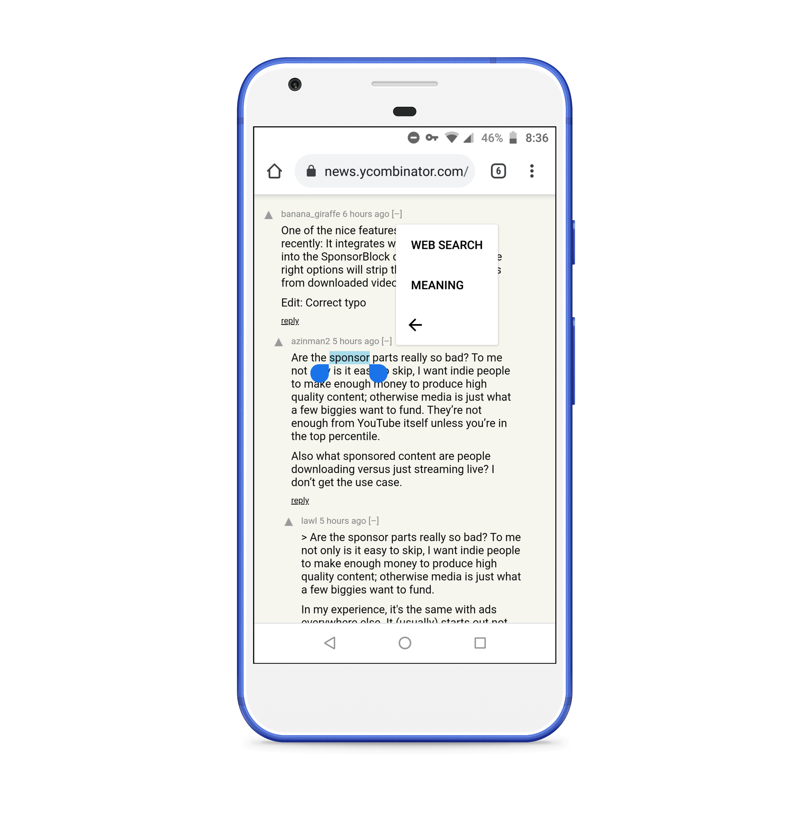

# Notification Dictionary

An Android application to display meaning of selected word as a notification.

## Features

- Easy access from all apps that have text selection.
- Enabled for offline usage.
- Wide variety of meanings from Wikitionary.
- Open source and MIT License.

# Database and github size limitation

- GitHub blocks files with size larger than 100MB.
- Create directory app/src/main/assets/databases/.
- Uncompress database.tar.gz available at root and move it to asset folder.

## Credits

- Wikitionary : https://www.wiktionary.org/
- Wikitionary parser : https://github.com/macdub/go-wiktionary-parse
- About page generator : https://github.com/medyo/android-about-page

## License

MIT License

## Screenshots

   
